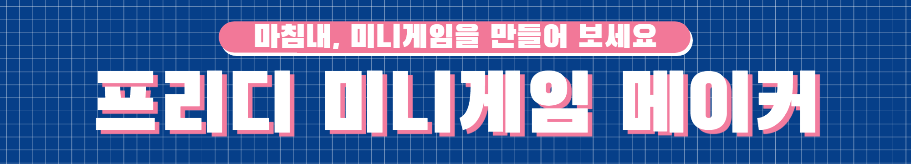

# 프리디 미니게임 메이커

***

#### 마침내, 미니게임을 만들어 보세요

#### 컨텐츠(미니게임)를 가볍고 사용하기 쉬운 구문을 통해 만들 수 있습니다.

#### 가벼운 성능이고 사용자가 간편하게 미니게임을 수정하고 적용할 수 있습니다.

### 다운로드
최신버전(추천합니다): [클릭 다운로드](https://github.com/FreedyPlugins/FreedyMinigameMaker/releases/latest/download/FreedyMinigameMaker.jar)

개발버전(최신기능을바로만나고싶다면): [클릭 다운로드](https://github.com/FreedyPlugins/FreedyMinigameMaker/raw/master/FreedyMinigameMaker.jar)

### 위키, 자습서 [바로가기](./FreedyMinigameMakerWiki)

### 플러그인 환경

이 플러그인은 1.12.2 에서 실행되도록 개발되었습니다 다른 버전은 지원되지 않습니다.  

이 플러그인은 Spigot 및 Paper에서 실행되도록 개발되었습니다. 다른 서버 유형은 아마 작동하지만 지원되지 않습니다.  

## 라이센스와 이용약관

#### 플러그인의 소스를 수정해서 사용 가능합니다.

#### 이 플러그인을 판매, 재배포 할 수 없습니다.

#### 개발자는 이 플러그인이 초래할 수있는 손상에 대해 법적 책임을지지 않습니다.

## 지원 또는 도움
브루스는 미니게임의 업그레이드를 위해서 언제나 사용자에게 도움을 줄 것 입니다. 이 웹사이트 맨 밑에 연락처가 있습니다.

***

### 커뮤니티 및 관련 사이트

#### 디스코드:  [바로가기](https://discord.gg/xej5Ut3)
#### 깃허브:  [바로가기](https://github.com/FreedyPlugins)
#### 오픈채팅:  [바로가기](https://open.kakao.com/o/gzol3Qeb)  

### 브루스 연락처:  

#### 전화번호: 010-2484-9240  
#### 카카오톡: Bruce0203  
#### 인스타그램: @ijongweon292  
#### 디스코드: 브루스#8183  

***

© 2020 Freedy Plugins. All Rights Reserved.
