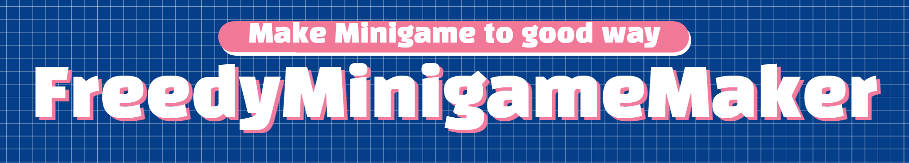

# Simple and useful Minecraft plugin, Freedy plugin

These plugins allow you to maintain and configure your server.
  

### Plugins

## FreedyMiniGameMaker 2 [Shortcut Links](./fmg2/korean_wiki.md)
Create arcade games with a script system.  
  

